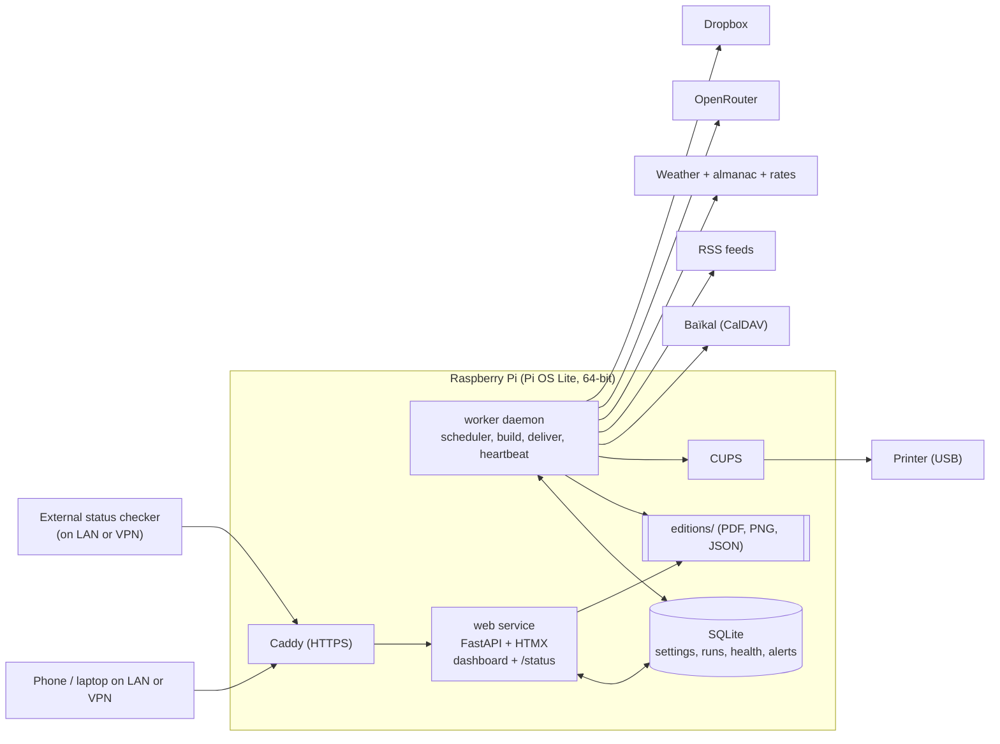

# "Your Nickname Times": Morning Newspaper on a Raspberry Pi
## Full Specification v1.1

A self-hosted morning paper. A Raspberry Pi collects your calendar, tasks, news, weather, almanac facts and a daily puzzle or comic, lays them out on one A4 page, prints it, and optionally uploads a copy to Dropbox. A local web dashboard configures and monitors everything, and a machine-readable status endpoint lets an external checker tell whether the system is healthy.

**Status:** planning complete, nothing implemented yet. This document supersedes v1.0.

### What changed since v1.0
- New **Status API** (`/status`) for external monitoring (section 10).
- Newspaper name is `{Nickname} Times` (default "Your Nickname Times"); motto is optional and **off by default**.
- **Weekend edition** is now a "lighter" edition: lighter news picks, friendlier note wording, easy puzzle, sun icon, short greeting.
- **Extras** (almanac and currency rates) fully specified: sunrise/sunset, moon phase, name day, on this day, EUR/USD/CHF to HUF.
- The old "heartbeat later" idea is replaced by the status endpoint; a push-style heartbeat stays optional.
- Printer notes updated for a USB printer of unknown model.

---

## 1. Decisions

| # | Topic | Decision |
|---|---|---|
| 1 | Language | Paper and dashboard default to **Hungarian**, switchable in settings (separate settings for each). RSS headlines print in their **original language**, so English hobby feeds stay English. |
| 2 | Paper | **A4**. Grid re-derived (section 5.2). |
| 3 | Task app | Unknown. The dashboard **discovers** calendars and task lists on Baïkal and lets you pick. |
| 4 | RSS | No hard-coded feeds. All feeds are managed in the dashboard (add, tag, test, OPML import/export). |
| 5 | OpenRouter | Funded key (1,000 requests/day). Sending task text to free providers is accepted; a "titles only" privacy switch still exists. |
| 6 | Hardware | Raspberry Pi 3B+ (probably), printer via **USB**, model TBD (section 14). |
| 7 | Time | Default **06:30**, configurable in the dashboard. |
| 8 | Daily item | xkcd included. **One item per day**: a comic on some days, a puzzle on others (rotation table in settings). |
| 9 | Cloud copy | **Trimmed** by default, changeable in the dashboard. |
| 10 | Access | **LAN only**; remote access through your own VPN. |
| 11 | HTTPS | Yes, internal certificate (browser warning accepted). |
| 12 | Login | One admin password. Reachable at `newspaper.local` **and** by the Pi's IP. |
| 13 | Weekends | Separate weekend edition with an on/off switch (schedule, lighter tone, sun icon). |
| 14 | Failures | Fallback paper built without an LLM. Global **LLM on/off switch**; off means the whole paper is built without AI. |
| 15 | Hold mode | Approve-before-print, **on by default**, switchable. |
| 16 | Retention | Dropbox: indefinite. Local: 30 days. Both configurable. |
| 17 | Alerts | Dashboard only for now. Push, email and Telegram come later. |
| 18 | Monitoring | **`/status` JSON endpoint**. An external checker that can read it sees the health; if it cannot reach it, the system is down. |
| 19 | UI | Minimal, utilitarian, **responsive and mobile-friendly**. A newspaper theme comes later (themed via CSS variables). |
| 20 | Tablet | One A4 PDF now. A tablet-friendly variant is a later milestone. |
| 21 | Title | `{Nickname} Times`, set in settings. Default text: "Your Nickname Times". |
| 22 | Motto | Optional small line under the title. **Empty by default**, user-settable. |
| 23 | Extras | All enabled: sunrise/sunset, moon phase, name day, on this day, EUR/HUF, USD/HUF, CHF/HUF. Each has its own toggle. |

### Defaults I chose (change any of them)
- The configured time (06:30) is when the build **starts**; delivery follows when the build succeeds (or when you approve, in hold mode).
- Weekend edition starts at **08:00**.
- Hold mode gates **both** printing and the Dropbox upload. Optional "auto-approve at HH:MM" is off by default.
- Local history in the dashboard matches the retention setting (30 days).
- Dropbox also keeps a fixed-name `latest.pdf` so the reMarkable import path never changes.
- News quota: about 4 interest and 4 local items, enforced by code, not by the model.
- Name day is included because it was in the extras list; switch it off if you don't want it.
- `/status` needs no login by default (it exposes no personal data and is LAN-only). An optional token is available.

---

## 2. Architecture



- **Two independent systemd services**, each with `Restart=always`. If the dashboard dies, the paper still prints. If the worker dies, the dashboard and `/status` show it.
- **Worker daemon:** wakes every 30 seconds, reads the schedule from SQLite, and runs an edition when due. On boot it checks for a missed run and catches up if it is still before the "latest acceptable time" (default 10:00).
- **Worker heartbeat:** every cycle the worker writes a timestamp and a health snapshot to SQLite. The web service reads it, which is how `/status` knows whether the worker is alive.
- **Job queue in SQLite** for "Run now", "Reprint", "Approve". The web service writes a job row, the worker picks it up and reports progress events that the dashboard shows live.
- **Clock guard:** the Pi 3B+ has no real-time clock. The worker refuses to build until NTP sync is confirmed, otherwise "AS OF" and day boundaries would be wrong.
- **Stack:** Python 3.11+, FastAPI, Jinja2, HTMX (no Node build step), SQLite, WeasyPrint, `caldav`, `feedparser`, `requests`, Pillow, an astronomy library for sun/moon times, Dropbox SDK or plain HTTP.

---

## 3. Edition lifecycle

```
scheduled -> collecting -> composing -> rendering -> [awaiting_approval] -> delivering -> done
                 \-> failed(reason)                        \-> done_degraded (fallbacks used)
```

- Every run writes a `run` record: per-step timing, per-source result, model used, items trimmed, and delivery result.
- A run ends as `done`, `done_degraded` or `failed`.
- **Failure policy:**
  - A source fails: that block falls back or collapses; the run continues (degraded).
  - The LLM fails after one retry: deterministic fallback for that block (degraded).
  - The PDF cannot be built, or exceeds one page after trimming: the run fails, **nothing prints**, alert raised.
  - Print fails: alert; the PDF stays available for manual reprint.
  - Dropbox fails: retried on the next tick; an alert appears after 3 failures.

---

## 4. The edition: content

All dates, weekdays and labels follow the paper language (Hungarian example: `2026. szeptember 21., hétfő`).

### 4.1 Masthead
- **Nameplate:** `{Nickname} Times` in the kit's masthead style. Default "Your Nickname Times" until you set a nickname.
- **Motto:** optional small line under the nameplate. Empty by default; when empty, the line collapses with no gap.
- **Dateline:** `Vol. N · date · weekday · city · AS OF hh:mm`.
  - `Vol. N` is the edition counter saved in the database.
  - `AS OF` is the time data collection began, not the print time.
- **Weekend edition extras:** a small sun icon next to the dateline and a short greeting line (both editable; icon can be switched off).

### 4.2 Sections

| Block | Source | Content rules |
|---|---|---|
| **News** | RSS | About 8 rows: headline, publisher, time. Last 24 h. Split between interest and local by quota. No AI-written prose. |
| **Today** | CalDAV | Events (time, title, place) and tasks due today (title, short description). Undated open tasks go on a separate "anytime" line. |
| **This Week** | CalDAV | Next 7 days grouped by day: events and due tasks. |
| **Weather** | Open-Meteo | Today high/low, short summary, 3-4 day outlook. On failure: "Forecast unavailable", never guessed numbers. |
| **Prep for Tomorrow** | CalDAV (+LLM) | Tomorrow's events and tasks. With LLM: one short preparation note per item, grounded only in the item's own text. Without LLM: the plain list. |
| **Due This Week** | CalDAV | Open tasks due in the next 7 days, excluding today and tomorrow (already shown). |
| **Overdue** | CalDAV | Open tasks due before today, oldest first, with "N days overdue". |
| **Daily item** | code / xkcd | One comic **or** one puzzle (section 6.4). |
| **Almanac and rates** | code / APIs | Sunrise/sunset, moon phase, name day, on this day, three currency rates (section 6.5). |

Empty blocks collapse and neighbors widen. Nothing prints "None" in a box.

### 4.3 Weekend edition ("lighter")
When the weekend switch is on, Saturday and Sunday use:
- **Schedule:** own start time (default 08:00).
- **News mood:** the picker is told to prefer upbeat, hobby and human-interest items over conflict, crime or disaster headlines. Local items that are directly relevant are still allowed. Without the LLM, hobby-category weights are raised instead. A setting (`light` or `neutral`) controls this.
- **Note wording:** planner notes are a little friendlier but stay plain. The kit's rules still apply (no jokes, no personification, no clever reversals).
- **Daily item:** easy sudoku difficulty and a larger box for the puzzle.
- **Small touches:** the sun icon (a static asset, not generated art) and a short greeting line, both editable.
- **Tasks:** shown in a compressed band so there is more room for the lighter content.

The weekday edition is the standard layout with none of the above.

---

## 5. Layout and rendering

### 5.1 Approach
Convert the kit's `template.html` into one Jinja2 template. Keep `edition.css`, the table-based grid, and WeasyPrint. Fonts (Chomsky, Libre Franklin, Newsreader) load from the kit's `fonts/` folder. The renderer is WeasyPrint only, never a browser.

### 5.2 A4 grid (proposed, verified in milestone 1)
The kit is US Letter (8.5 in wide, 0.32 in margins, 7.86 in content). A4 is 8.27 in wide. Keeping the 0.32 in margins gives 7.63 in of content:
- 6 columns of about 1.197 in, with 0.09 in gutters
- Span-4 ≈ 5.06 in, Span-2 ≈ 2.48 in
- `@page { size: A4; margin: 0 }`. A4 is about 0.69 in taller than Letter, which gives more vertical room.

### 5.3 Language and glyph checks (must pass in milestone 1)
- Hungarian `ő` and `ű` render correctly in **every** font used, especially the Chomsky nameplate, since the nickname may contain them. If a glyph is missing, use a fallback font for that character or warn in the dashboard.
- `lang="hu"` with WeasyPrint hyphenation is tested on real headlines.
- Typographic quotes follow the paper language (Hungarian `„ ”`).

### 5.4 Overflow handling
Render, then count pages. If more than one page, drop the lowest-priority item and re-render. Never shrink body type. Drop order (first to last): almanac details, extra week rows, extra news rows, descriptions, second-tier prep notes. Every drop is written to the run report.

### 5.5 Two PDFs per edition
- `print.pdf` (full).
- `cloud.pdf` (trimmed unless the cloud level is set to Full): no task descriptions, no event locations or attendees, no prep notes. Rendered from the same content snapshot, so both are always consistent.

---

## 6. Data sources

### 6.1 CalDAV (Baïkal)
- **Discovery:** list all calendars and task lists on the server with their supported component types (`VEVENT`, `VTODO`). The dashboard lets you tick which ones to include.
- **Events:** use `search(expand=True)` so recurring events expand correctly.
- **Tasks:** read `SUMMARY`, `DESCRIPTION`, `DUE`, `PRIORITY`, `STATUS`, `CATEGORIES`. Completed and cancelled tasks are ignored. Recurring tasks show the current occurrence only.
- Handle both date-only and date-time values; convert everything to the configured timezone (default Europe/Budapest).
- Auth: Basic or Digest; HTTPS recommended.

### 6.2 RSS
- Per feed: URL, name (used as publisher), category (`interest` or `local`), language, weight, max items, enabled.
- Fetch, keep entries from the last 24 h by published time, deduplicate by URL then fuzzy title.
- Entries with no publish time are excluded by default (setting).
- OPML import and export.
- The pool sent to the LLM is capped at about 60-80 items.

### 6.3 Weather
Open-Meteo, with location (coordinates) and units in settings.

### 6.4 Daily item (comic or puzzle)
- A **rotation table** (weekday to type) in settings. Default: xkcd Mon/Wed/Fri/Sun, sudoku Tue/Thu/Sat.
- **xkcd:** JSON API, a random unseen comic (history kept in the database). Skip interactive, very tall or very wide comics. Convert to grayscale. Print the alt text as a caption (English) and credit `xkcd.com, CC BY-NC 2.5`. If the fetch fails, use the day's puzzle instead.
- **Sudoku:** generated by code with a verified unique solution. Difficulty by weekday; easy on weekends.
- **Later:** mini crossword, Jumble, word search. They need a Hungarian word list (with diacritics and a compatible license), so they are deferred. Puzzles are never LLM-made unless the code verifies them.

### 6.5 Almanac and rates (no LLM needed)

| Item | Source | Notes |
|---|---|---|
| **Sunrise and sunset** | Computed locally from coordinates and date | Works offline. |
| **Moon phase** | Computed locally | Works offline. Show phase name and illumination. |
| **Name day** | Static table in the project | Hungarian calendar. The dataset and its license are verified in milestone 2. Toggle on/off. |
| **On this day** | Wikipedia "on this day" feed | Prefer Hungarian Wikipedia if available, else English (verified in milestone 2). Choose 1-3 short entries by code (for example the ones with the most notable pages), print them as written, and credit Wikipedia (CC BY-SA). |
| **EUR/HUF, USD/HUF, CHF/HUF** | A free daily-rates API | Candidates: an ECB-based free API (cross-rates computed to HUF) or the Hungarian National Bank (MNB) daily rates. The choice is made in milestone 2. Print the value **with its date and source**. Reference rates update on working days, so weekends and holidays show the last published date. |

Rules:
- If an item cannot be fetched, it is omitted. Nothing is estimated.
- Each item has its own toggle in settings.
- **Two densities:** compact in the normal edition (a small strip, dropped first on overflow), **expanded in the fallback and no-LLM edition** (more on-this-day entries, extra detail), which is what turns the fallback into a fuller "static information" paper.

---

## 7. LLM layer (OpenRouter)

### 7.1 Modes
1. **LLM on** (default): full paper.
2. **Degraded:** LLM enabled but a call failed, so that block uses a deterministic fallback.
3. **LLM off** (global switch): the paper is always built deterministically.

Deterministic behavior:
- **News:** recency plus per-feed weight plus interest keyword score, with the same quotas.
- **Prep for Tomorrow:** the plain list of tomorrow's items, with descriptions.
- **Almanac and rates** expand to fill space.

### 7.2 Calls (2 per day, plus retries)
1. **News picker.** Input is a numbered list of titles and short snippets plus the edition mood (`normal` or `light`). Output is JSON `{"picks": [{"id": 12, "category": "interest"}, ...]}`. Only IDs come back. The script prints the original headline, publisher and time, so the model cannot alter or invent them. Quotas are enforced in code after the model answers.
2. **Planner.** Input is tomorrow's tasks and events. Output is JSON with one note per item, up to a character limit.

### 7.3 Robustness
- Validate against a JSON schema; unknown IDs are dropped; over-length notes are rejected.
- One retry with a stricter prompt, then fallback.
- Default `openrouter/free`; optionally pin a specific `:free` or paid model for consistency.
- The router may choose a different model each time, so the run report records the model that answered.
- Per-call timeout and a daily request counter, shown on the dashboard, to watch the rate limit.

### 7.4 Privacy
- Setting **"send task descriptions to the LLM"** (default: yes, as you accepted). Turning it off sends titles only.
- The exact prompt and response of every call are stored with the edition, so you can see what left the Pi.
- Free providers may log prompts; this is the accepted tradeoff.

### 7.5 Prompt principles (Hungarian output)
Condensed from the kit's copy rules: plain literal language; no personifying the calendar or tasks; no "X is not Y, it is Z" constructions; no closing kicker; no advice beyond the task's own text; no invented facts; a hard character budget per field. In the light (weekend) mood the tone may be a little warmer, but these rules still apply. Hungarian quality from free models varies, which is another reason the picker returns only IDs.

---

## 8. Delivery

### 8.1 Print
- CUPS `lp` with A4, grayscale, 100% scale, duplex per setting.
- The worker follows the CUPS job until it completes or fails. "Accepted by CUPS" alone is not treated as printed.
- Test page and reprint from the dashboard.

### 8.2 Dropbox
- A Dropbox app with **app-folder** access, so the Pi can only touch its own folder.
- Authorization via the headless "open this link, approve, paste the code" flow; a refresh token is stored.
- Layout: `editions/YYYY-MM-DD.pdf` plus a fixed `latest.pdf`. Retention default: keep forever.
- The reMarkable's Dropbox integration is pull-based (browse, long-press, import), so the fixed `latest.pdf` name keeps the manual step short.

### 8.3 Hold mode
- **On by default.** The edition builds at the scheduled time and waits as `awaiting_approval`.
- Dashboard actions: **Approve**, **Reject**, **Regenerate** (fresh data, new AS OF time), **Download preview**.
- Approving prints and uploads what was built. If the data is hours old, use Regenerate.
- Optional auto-approve at a chosen time (off by default).
- An edition waiting for approval counts as **produced** for monitoring; a long wait raises an information alert, not a failure.

### 8.4 Delivery switches
Print on/off, upload on/off (both, one, or none), plus one-day overrides such as "skip tomorrow" and "upload only tomorrow".

### 8.5 Retention
Local default 30 days, Dropbox default forever. Both editable. Local pruning deletes the PDFs, previews and snapshots of expired editions.

---

## 9. Dashboard

Mobile-first responsive layout, minimal theme, server-rendered pages with HTMX. All styling goes through CSS variables, so a newspaper theme can replace colors and fonts later. Dashboard language is Hungarian or English, independent of the paper language.

### 9.1 Pages

**Status (home)**
- Banner for the latest edition: done, degraded, failed, or awaiting approval (with Approve and Reject buttons).
- Tiles with green/yellow/red/unknown: Baïkal, RSS feeds (grouped), weather, almanac and rates, OpenRouter (with requests used today), Dropbox, printer, worker, and Pi health (disk, temperature, uptime, Wi-Fi, clock sync).
- Each tile shows the last success time and a plain-language last error.
- Next scheduled run and the active mode (weekday or weekend, hold, LLM on/off).
- A **setup checklist** while required settings are missing (nickname, city, Baïkal, feeds, printer, Dropbox).
- A "Monitoring" box: the `/status` URL to copy and the time of the last request, so you can see whether a checker is actually polling.

**Editions**
- The last 30 days: thumbnail, status flags, and download buttons for both PDFs.
- Per edition: run report, content snapshot, prompts and responses, reprint and re-upload buttons.

**Settings** (in sections; each has a **Test** button and validation before saving)
- **General:** nickname (title becomes `{Nickname} Times`), optional motto (empty by default), city and coordinates, timezone, paper language, dashboard language, paper size (A4).
- **Schedule:** weekday time, weekend edition switch and time, latest acceptable time, hold mode, auto-approve.
- **Weekend touches:** news mood (light or neutral), sun icon on/off, greeting text.
- **Delivery:** print, upload, both, none; cloud trim level; retention for local and Dropbox.
- **Calendar and tasks:** Baïkal URL, username, password; discovery and pickers for calendars and task lists.
- **News:** feed table with add, edit, test, enable, tag, weight, language; OPML import and export; quotas.
- **Weather, daily item and almanac:** location, units, rotation table, xkcd on/off, each almanac and rate item on/off.
- **LLM:** on/off switch, API key, router or pinned model, "send descriptions" switch, per-call limits.
- **Dropbox:** guided authorization and folder settings.
- **Printer:** printer picker from CUPS, duplex, test page.
- **System:** admin password, `/status` options (enabled, token, plain-HTTP port), backup and restore of settings (secrets excluded), diagnostics bundle download.

**Logs:** recent run logs with filter; diagnostics bundle with secrets redacted.

**Actions:** Run now (preview only, or build and deliver), reprint a past edition, live progress (collect, LLM, render, print, upload).

### 9.2 Settings storage
- Settings live in SQLite with the last few versions kept for rollback.
- Secrets live in a separate `chmod 600` file and are **never sent to the browser**: the UI shows "saved" and offers replace only. Logs and diagnostics are redacted.

---

## 10. Status API (external monitoring)

### 10.1 Purpose
An external status checker (for example Uptime Kuma or any HTTP/JSON monitor) polls the endpoint. **If it can read a healthy response, the system is healthy. If it cannot reach the endpoint, the system is down.** Nothing on the Pi has to push anything.

### 10.2 Endpoint
- `GET /status` on both `https://newspaper.local/status` and `https://<pi-ip>/status`. Also answers `HEAD`.
- Returns JSON with `Cache-Control: no-store`.
- No login by default. An optional token (`Authorization: Bearer ...`) can be enabled in settings. The response contains **no personal data** (no task or event text, no feed URLs, no secrets) and error messages are redacted.
- Computed from the database and the worker's heartbeat, and cached for a few seconds, so polling is cheap.
- An optional **plain-HTTP, status-only port** (default off) is available for checkers that can't accept the internal certificate. Otherwise the checker must trust the certificate or be set to ignore certificate errors.

### 10.3 HTTP status codes
| Code | Meaning |
|---|---|
| **200** | `status` is `ok` or `degraded`. The service works. |
| **503** | `status` is `down`. |
| **200 vs 503 for degraded** | `?strict=1` returns 503 for `degraded` as well, for checkers that alert only on non-200 codes. |
| **No response, timeout, connection refused, or 502** | The Pi, the web service or the proxy is down. The checker treats this as **down**. |

### 10.4 Overall status rules
- **`down`:**
  - The worker heartbeat is stale (default: no beat for 2 minutes).
  - The latest acceptable time has passed with no edition built, and none is in progress or awaiting approval.
  - The database is unreadable.
  - The clock has not synced after boot (past a grace period).
  - Disk space is critically low.
- **`degraded`:**
  - The last edition ended `done_degraded`.
  - Any source check is red or yellow (Baïkal, feeds, weather, almanac, LLM, Dropbox).
  - The printer reports a problem.
  - A run failed but the service can still run.
  - Open warning-level alerts exist.
- **`ok`:** everything else. An edition awaiting approval by itself is still `ok`.

### 10.5 Response shape (example)

```json
{
  "status": "degraded",
  "time": "2026-09-21T06:41:12+02:00",
  "version": "1.0.0",
  "uptime_seconds": 864211,
  "worker": { "alive": true, "last_heartbeat": "2026-09-21T06:41:02+02:00" },
  "schedule": {
    "next_run": "2026-09-22T06:30:00+02:00",
    "mode": "weekday",
    "hold_mode": true,
    "llm_enabled": true
  },
  "last_edition": {
    "date": "2026-09-21",
    "status": "done_degraded",
    "awaiting_approval": true,
    "finished_at": "2026-09-21T06:33:40+02:00"
  },
  "checks": {
    "caldav":  { "status": "ok",       "last_success": "2026-09-21T06:30:03+02:00", "message": null },
    "rss":     { "status": "degraded", "feeds_ok": 9, "feeds_total": 10, "message": "1 feed failing" },
    "weather": { "status": "ok",       "last_success": "2026-09-21T06:30:05+02:00", "message": null },
    "almanac": { "status": "ok",       "last_success": "2026-09-21T06:30:08+02:00", "message": null },
    "llm":     { "status": "ok",       "requests_today": 2, "daily_limit": 1000, "message": null },
    "dropbox": { "status": "ok",       "last_success": "2026-09-20T06:40:11+02:00", "message": null },
    "printer": { "status": "ok",       "state": "idle", "message": null }
  },
  "system": { "disk_free_mb": 21450, "cpu_temp_c": 48.2, "ntp_synced": true },
  "alerts": [
    { "code": "feed_dead", "severity": "warning", "since": "2026-09-19T06:30:00+02:00" }
  ]
}
```

Field names are stable so a JSON-aware checker can assert on individual fields (for example `status == "ok"` or `checks.printer.status == "ok"`).

### 10.6 Deployment notes
- The checker must be on the LAN or reachable through your VPN. A cloud-hosted monitor cannot reach a LAN-only Pi, and I would not open a port to make it work.
- Reserve a fixed IP for the Pi in your router. `newspaper.local` may not resolve over a VPN or on some Android versions, so the IP always works.
- The dashboard records when `/status` was last requested, so you can tell whether monitoring is actually running.
- A push-style heartbeat (the Pi pings an outside service) remains an optional later feature, and would need internet access to that service.

---

## 11. Health checks and alerts

### 11.1 Checks
- **Printer:** status via CUPS, polled every minute (state and reasons such as paper out or low toner **where the printer reports them**; a USB printer may only reveal a jam when a job fails).
- **Other sources:** checked during runs, by the Test buttons, and by an optional hourly light check.
- **Pi metrics:** disk space, CPU temperature, uptime, Wi-Fi signal, NTP sync.
- **Worker:** heartbeat age.

### 11.2 Alerts (dashboard banners now, other channels later)
Shown on the Status page with a severity and dismiss/acknowledge.

| Alert | Trigger |
|---|---|
| Worker not responding | Heartbeat stale |
| No edition by deadline | No edition built by the latest acceptable time |
| Run failed | Any failed run |
| Degraded edition | Fallbacks were used |
| Printer problem | CUPS error or job failed |
| Dropbox problem | 3 failed uploads or expired authorization |
| Feed dead | A feed fails N times in a row |
| Waiting for approval | An edition is held for more than N hours (info) |
| LLM limit | Requests approaching the daily limit |
| Disk low | Below threshold |

### 11.3 Notification channels (later)
ntfy, email and Telegram sit behind a simple notifier interface so adding them is cheap. Until then, the dashboard and `/status` are the only channels.

---

## 12. Security

- **LAN only**, no port forwarding. Remote access through your VPN (it must route your LAN subnet).
- **HTTPS** through Caddy with an internal certificate for `newspaper.local` and the Pi's IP. Expect a one-time browser warning; installing Caddy's root certificate on a device removes it.
- The app binds to localhost; only Caddy listens on the LAN.
- One admin password (hashed), session cookies, CSRF protection, login rate limiting.
- **First-run setup code** shown on the Pi's console or log, so the first person on your Wi-Fi can't claim the dashboard.
- PDF downloads sit behind login.
- `/status` is the only unauthenticated route, exposes no personal data, and has an optional token and rate limit.
- Outbound fetches accept only `http(s)` URLs. No user input reaches a shell command.
- SSH by key only; the firewall allows only 443 (and 22) from the LAN, plus the optional status port; automatic security updates enabled.

---

## 13. Deployment (Raspberry Pi 3B+)

- Raspberry Pi OS Lite 64-bit, headless via Imager (Wi-Fi, SSH, hostname `newspaper`, timezone Europe/Budapest).
- The 3B+ has 1 GB RAM and a modest CPU: enough for one page render, the web service and Caddy, but rendering is slower than on a laptop. Milestone 1 measures it.
- Packages: CUPS, Pango/HarfBuzz/GDK-Pixbuf system libraries, Python venv, Caddy, Avahi (for `.local`).
- Use a decent SD card and keep logs small and rotated to limit write wear.

### Data layout

```
data/
  newspaper.db        # settings, feeds, editions, runs, events, health, alerts, jobs
  secrets.env         # chmod 600
  cache/              # xkcd images, feed ETags, almanac and rate caches
  editions/2026-09-21/
    print.pdf  cloud.pdf  preview.png
    edition.json      # content snapshot
    llm/              # prompts and responses
    run.log
```

**Main tables:** `settings`, `feeds`, `editions`, `runs`, `run_events`, `health_checks`, `alerts`, `jobs`, `puzzle_history`, `rate_history`, `heartbeat`, `admin`.

**Content snapshot (`edition.json`):** masthead, news items, today, week, weather, prep, due-this-week, overdue, daily item, almanac and rates, and metadata (mode, model used, trims). Both PDFs are always rendered from it.

---

## 14. Hardware notes

- **Pi 3B+:** fine for this job (section 13).
- **USB printer, model unknown.** The model matters for one reason: **driver support**. Most modern printers work "driverless" through CUPS/IPP, and many manufacturer-supported models work with a standard driver package. Some cheap "host-based" (GDI-style) models work only with vendor Windows drivers and are unreliable on Linux.
- What to look at on the label or box: brand and exact model number. In milestone 0, plug it in and check whether CUPS detects it and prints a CLI test page. Checking the model on the OpenPrinting driver database beforehand is worthwhile.
- **Laser vs inkjet:** a laser is more dependable for a once-a-day job because its output doesn't dry out. An inkjet's nozzles can clog if it sits unused.
- Also check that the printer can be configured for A4 and grayscale, and set it not to go into a deep sleep that ignores USB wake-ups (varies by model).

---

## 15. Milestones and acceptance criteria

| # | Milestone | Done when |
|---|---|---|
| 0 | **Smoke tests** | Pi boots headless; CUPS prints a test page via `lp` on the USB printer; a script lists Baïkal calendars and tasks; the OpenRouter key answers a test call; a Dropbox app-folder upload works. |
| 1 | **Static A4 layout** | Fake Hungarian data renders as exactly one A4 page; `ő/ű` are correct in all fonts; the title `{Nickname} Times`, empty-motto collapse and weekend sun icon all render; it prints with sensible margins; render time measured on the Pi. |
| 2 | **Deterministic edition** | Real CalDAV, RSS, weather, sudoku, xkcd, sunrise/sunset, moon, name day, on this day and the three currency rates fill the page with no LLM; content snapshot saved; overflow loop works; data sources and licenses for name day, on this day and rates decided. This is the fallback paper. |
| 3 | **Worker and delivery** | Daemon with SQLite state machine and heartbeat, config file, weekday and weekend schedules, catch-up after boot, hold flag, print with job tracking, Dropbox upload, retention. Reliable for days **without any UI**. |
| 4 | **LLM layer** | News picker and planner with validation, retry, fallback, LLM on/off switch, weekend mood, stored prompts. |
| 5 | **Dashboard v1 and `/status`** | Login, status tiles, editions list and downloads, approve/reject/regenerate, run now, logs, and the `/status` endpoint. Killing the worker turns `/status` to `down` (503) within about 2 minutes; unplugging the printer turns it `degraded`; stopping the web service makes the endpoint unreachable. |
| 6 | **Dashboard v2** | Full settings editing with Test buttons, Dropbox authorization, OPML, printer picker, Hungarian and English UI, setup checklist, mobile-friendly. |
| 7 | **Hardening** | Caddy HTTPS, setup code, rate limiting, firewall, auto-updates, optional status token and status-only HTTP port. |
| 8 | **Burn-in** | One week of real editions in hold mode with an external checker polling `/status`; tune density and copy; then decide whether to turn hold off. |

**Later:** ntfy/email/Telegram notifications, push-style heartbeat, newspaper-themed dashboard, tablet-friendly variant, mini crossword and Hungarian word puzzles for weekends, installable web app.

---

## 16. Non-goals (v1)

Multiple users, internet exposure, editing the page layout in the UI beyond section toggles and item counts, reading email, image generation.

---

## 17. Remaining unknowns (resolved during the build; none blocks the start)

1. **Printer model:** found in milestone 0 when you plug it in.
2. **Task app and how tasks are stored:** discovered in milestone 0 through the CalDAV listing.
3. **Data choices:** name day dataset, on-this-day source and currency-rate source, decided in milestone 2.
4. **Feeds:** you add them in the dashboard (or import an OPML file) once it exists; the deterministic build in milestone 2 uses a small list in the config file.
5. **Weekend greeting text:** anything short you like; it can be changed in the dashboard at any time.
